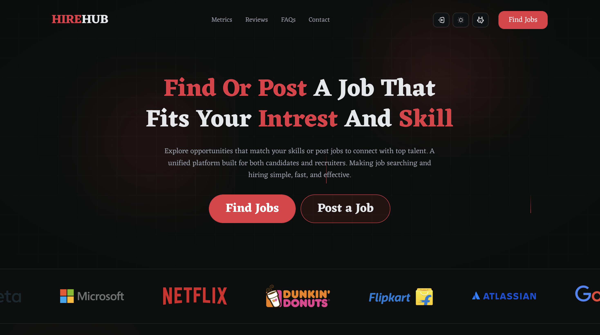

# HireHub



Job board for candidates (browse and apply) and employers (post jobs, review applications). Auth is email/password or Google; roles are `candidate` and `employer` on the user row.

Monorepo: Next.js app in `client/`, Express API in `server/`. No root workspace.

## Stack

| Layer | What is in use |
| --- | --- |
| Client | Next.js 16 (App Router), React 19, TypeScript |
| UI | Tailwind CSS 4, shadcn/ui (Radix), Hugeicons, Framer Motion, Embla, Sonner |
| Client state | React Context (auth, modals, theme), Redux Toolkit + persist (AI chat/feedback only) |
| HTTP | Axios (`withCredentials`), cookie JWT |
| API | Express 5, TypeScript, Prisma 7 (`@prisma/adapter-pg`), PostgreSQL |
| Auth | bcryptjs, jsonwebtoken (HttpOnly cookie), Google OAuth |
| Uploads | Multer → `server/uploads/resumes`, served at `/uploads` |

## Layout

```
client/                 Next.js app
  src/app/              routes: /, /jobs, /jobs/[jobId], /employer
  src/components/       feature UI (home, jobs, employer, auth, …)
  src/services/         authApi, jobsApi, employerApi
  src/providers/        Auth, theme, modals, Redux
  src/redux/            chat + feedback slices
server/
  src/routes|controllers|middlewares|config|utils|seeds
  prisma/schema.prisma  database
  uploads/              resume files
```

```
browser → client pages/components → Context / local state / Redux
        → *Api services (axios) → /api/v1/* → Express controllers → Prisma → PostgreSQL
```

### Client routes

- `/` — landing
- `/jobs` — open jobs + filters
- `/jobs/[jobId]` — details + apply
- `/employer` — tabs via `?tab=` (`dashboard`, `my-jobs`, `post-job`, `profile`, `settings`)

Auth UI is header/modals, not `/auth/*` routes.

### API (`/api/v1`)

**Auth:** `POST /auth/signup`, `POST /auth/login`, `POST /auth/logout`, `GET /auth/me` (protected), `GET /auth/google`, `GET /auth/google/callback`

**Jobs:** `GET /jobs`, `GET /jobs/:jobId`, `POST /jobs` (employer), `POST /jobs/:jobId/apply` (candidate, `multipart/form-data`: `resumeFile`, `coverLetter`)

**Employer (all protected):** `GET /dashboard`, `GET /profile`, `GET /my-jobs`, `DELETE /jobs/:jobId`, `GET /jobs/:jobId/applications`, `PATCH /applications/:applicationId/status`

**Health:** `GET /health`

Persistence: Prisma models `User`, `EmployerProfile`, `Job`, `Application`, `Skill`, `JobSkill`. Skills go through `skills` + `job_skills`. `requirements` and `responsibilities` are `String[]` on `jobs`. Application status: `pending` | `reviewed` | `accepted` | `rejected`. Schema: `server/prisma/schema.prisma`.

## Setup

Needs PostgreSQL. Client default origin `http://localhost:3000`. Server `PORT` defaults to `5000`; client API default is `http://localhost:5001/api/v1` — set env so they match.

**Client** (`client/.env.local`)

| Name | Role |
| --- | --- |
| `NEXT_PUBLIC_SERVER_URL` | API base including `/api/v1` |
| `NEXT_PUBLIC_OPENROUTER_API_KEY` | AI assistant |
| `NEXT_PUBLIC_OPENROUTER_MODEL` | optional model id |

```bash
cd client
bun install
bun run dev      # next dev
bun run lint
bun run build
bun run start
```

**Server** (`server/.env`)

| Name | Role |
| --- | --- |
| `DATABASE_URL` | Postgres connection |
| `PORT` | listen port (default `5000`) |
| `NODE_ENV` | `development` / `production` |
| `CLIENT_URL` | CORS + OAuth return (default `http://localhost:3000`) |
| `JWT_SECRET` | required for tokens |
| `AUTH_COOKIE_NAME` | cookie name (default `jwt-token`) |
| `GOOGLE_CLIENT_ID` | Google OAuth |
| `GOOGLE_CLIENT_SECRET` | Google OAuth |
| `GOOGLE_REDIRECT_URL` | OAuth callback URL |

```bash
cd server
bun install
bun run dev      # nodemon + ts-node
bun run lint
bun run build    # prisma generate && tsc
bun run start    # node dist/server.js
bun run seed:all
```

Other seeds: `seed:user`, `seed:employer-profile`, `seed:jobs`, `seed:my-jobs`, `seed:applications`.
